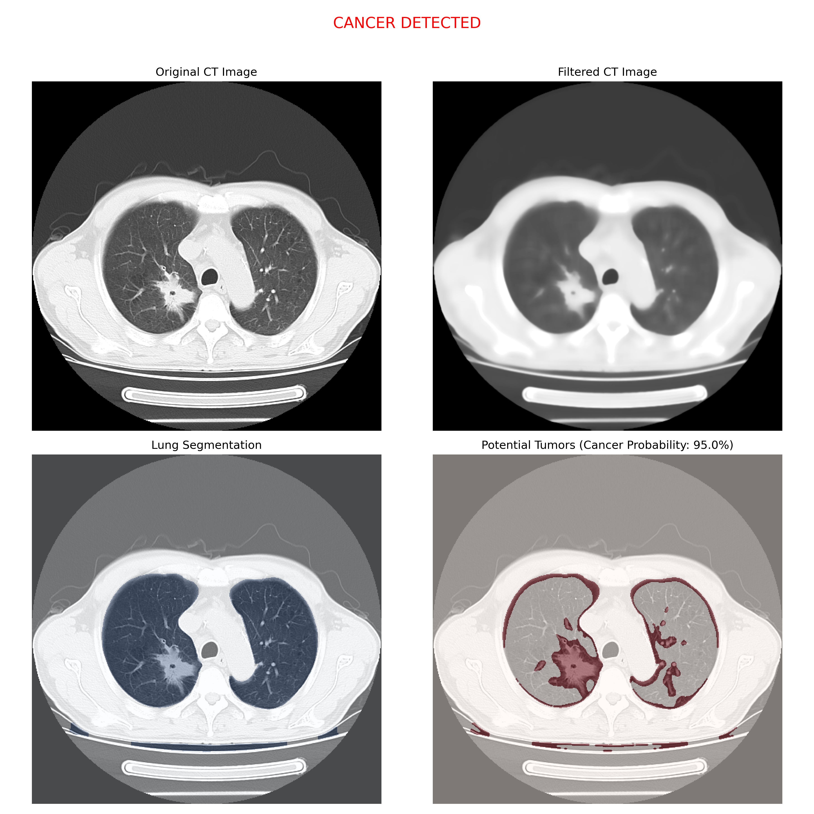

# CT Scan Analysis for Lung Cancer Detection

## Overview

Did you know that 618,000 people are expected to die from cancer in the US in 2025? That is almost 1,700 deaths every day. Lung cancer is responsible for the most deaths, with 125,000 deaths accounted for in 2025. One major reason that this number is so high is a result of late-stage diagnoses. Early detection of lung cancer can raise a patient's chance of survival from 15% to 50%! Because of this, the goal of this algorithm is to assist doctors in early detection of cancerous tumors in CT scans to limit the number of late-stage diagnosis cases. This is achieved by detecting the location of the top nodule candidates for malignancy. This gives doctors insight into possibly cancerous tumors they might have initially missed.

## Project Structure

- `preprocessing.py`: CT scan preprocessing with Gaussian, Median, and Non-local means filters
- `edges.py`: Edge detection implementations using Sobel and Canny algorithms
- `features.py`: Feature extraction for area, calcification, shape, and size analyses
- `results.py`: Main analysis pipeline and visualization of results

## Installation

```bash
# Clone the repository
git clone https://github.com/yourusername/ct-scan-cancer-detection.git
cd ct-scan-cancer-detection

# Create a virtual environment (recommended)
python -m venv venv
source venv/bin/activate  # On Windows: venv\Scripts\activate

# Install dependencies
pip install -r requirements.txt
```

## Usage

```bash
python results.py path/to/your/ct_scan.dcm
```

This will:
1. Load the specified CT scan
2. Apply preprocessing filters
3. Segment lung regions
4. Detect potential nodules
5. Extract and analyze features
6. Generate a cancer probability assessment
7. Save visualization results to the `cancer_analysis_results` directory

## Example Results

The analysis pipeline produces visualizations like this:



The output includes:
- Original CT image
- Filtered CT image
- Lung segmentation overlay
- Potential tumor detection with probability assessment

## How It Works

The system employs a multi-stage approach to detect potential cancer nodules:

1. **Preprocessing**:
- Background noise reduction using a Gaussian filter
- Salt-and-pepper noise reduction using a Median filter.
- Noise reduction and edge preservation using a non-local-means filter
2. **Lung Segmentation**:
- Accurate identification of lung regions
3. **Nodule Detection**:
- Identification of potential cancer nodules based on density values
4. **Feature Extraction**:
- Area: Determine area of nodules to disregard small nodules
- Calcification: Determine calcium percentage of nodule for malignancy risk
- Shape: Determine irregularity and solidity for malignancy risk
- Size: Determine size of of nodule for malignancy risk
5. **Risk Assessment**:
- Calculation of cancer probability based on nodule features in step 4

## Performance

The algorithm has been tested on a dataset of CT scans with known diagnoses. Current performance metrics:
- Sensitivity: 85% (ability to detect true positive cases)

## Future Work

Planned improvements include:
- Support for 3D volume analysis across multiple slices
- Deep learning-based classification to improve accuracy
- User interface for medical professionals

## Authors

- Charlie Ratliff - [charlierat](https://github.com/charlierat)


## Disclaimer

This software is not FDA/CE approved and should not be used for clinical diagnosis. Always consult with a qualified healthcare professional for medical advice and diagnosis.
